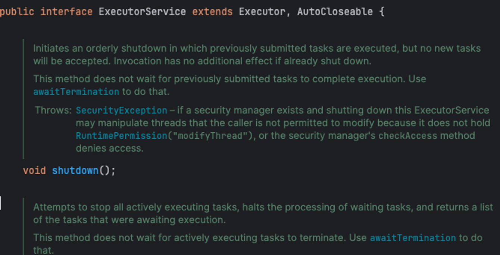
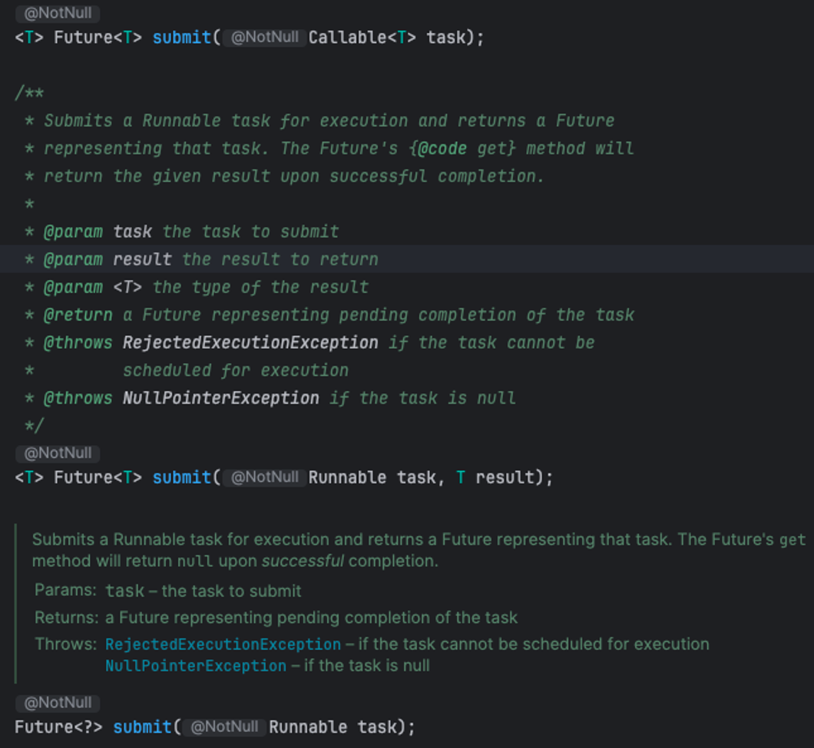
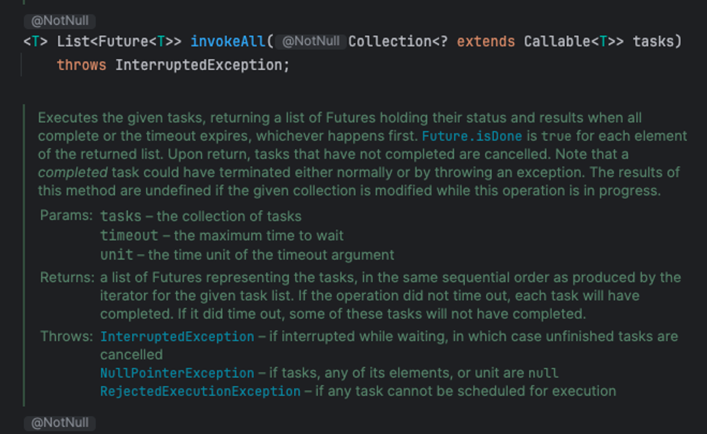
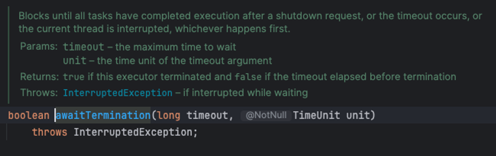
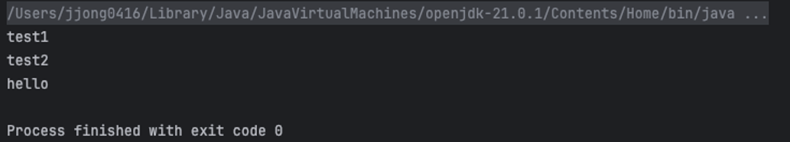
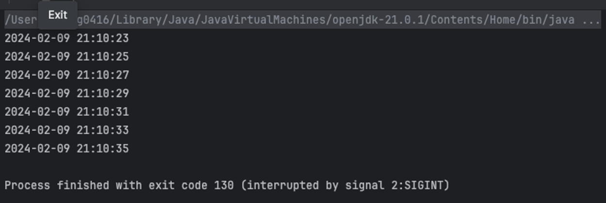
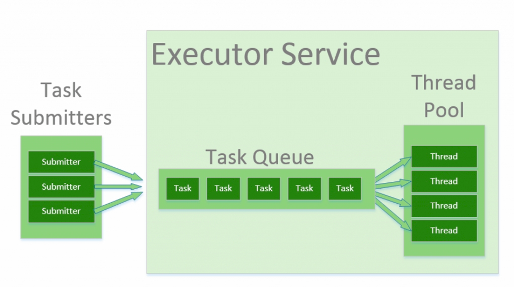
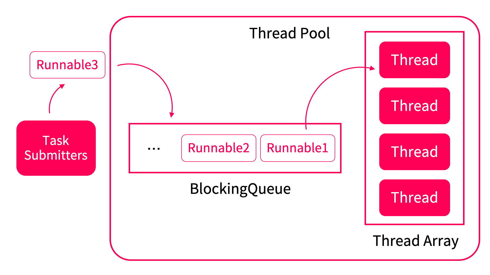

## 0️⃣. 서론

책 초판에는 아이템 49에서는 단순한 작업 큐(work queue)를 선보였다. 그 클래스는 클라이언트가 요청한 작업을 **백그라운드 스레드에 위임해 비동기적으로 처리**했다. 작업 큐에 대해 엄청 복잡했는데, 지금은 그럴 필요가 없다. `java.util.concurrent`가 등장했기 때문이다.

## 1️⃣. 실행자 프레임워크(Executor Framework)

실행자 프레임워크는 `java.util.concurrent` 패키지에 속해있으며, 인터페이스 기반의 유연한 테스크 실행 기능을 담고 있다. 기존보다 **모든 면에서 뛰어난 작업 큐를 단 한줄로 생성**할 수 있다.



```java
// 작업 큐 생성
ExecutorService exec = Executors.newSingleThreadExecutor();

// 실행할 태스크를 넘김
exec.execute(runnable);

// 실행자 종료 -> 우아하게 종료시키는 방법이고, 해당 작업이 실패하면 VM 자체가 종료되지 않는다.
exec.shutdown();
```

## 2️⃣. 실행자 서비스(ExecutorService)의 주요 기능

### A) 특정 태스크가 완료되기를 기다린다. (`submit().get()`)

```java
ExecutorService exec = Executors.newSingleThreadExecutor();
exec.submit(()  -> s.removeObserver(this)).get(); // 끝날 때까지 기다린다.
```



### B) 태스크 모음 중에 어느 하나 혹은 모든 태스크가 완료되기를 기다린다.

```java
List<Future<String>> futures = exec.invokeAll(tasks);
System.out.println("All Tasks done");
exec.invokeAny(tasks);
System.out.println("Any Task done");
```



### C) 실행자 서비스가 종료되기를 기다린다

```java
Future<String> future = exec.submit(task);
exec.awaitTermination(10, TimeUnit.SECONDS);
```



### D) 완료된 태스크의 결과를 차례로 받는다.

```java
final int MAX_SIZE = 3;
ExecutorService executorService = Executors.newFixedThreadPool(MAX_SIZE);
ExecutorCompletionService<String> executorCompletionService = new ExecutorCompletionService<>(executorService);

List<Future<String>> futures = new ArrayList<>();
futures.add(executorCompletionService.submit(() -> "test1"));
futures.add(executorCompletionService.submit(() -> "test2"));
futures.add(executorCompletionService.submit(() -> "hello"));

for (int loopCount = 0; loopCount < MAX_SIZE; loopCount++) {
    try {
        String result = executorCompletionService.take().get();
        System.out.println(result);
    } catch (InterruptedException e) {
        //
    } catch (ExecutionException e) {
        //
    }
}
executorService.shutdown();
```



### E) 태스크를 특정 시간 혹은 주기적으로 실행하게 된다.

```java
ScheduledThreadPoolExecutor executor = new ScheduledThreadPoolExecutor(1);

executor.scheduleAtFixedRate(() -> {
    System.out.println(DateTimeFormatter.ofPattern("yyyy-MM-dd HH:mm:ss")
            .format(LocalDateTime.now()));
}, 0, 2, TimeUnit.SECONDS);
```



큐를 둘 이상의 스레드가 처리하게 하고 싶다면 다른 정적 팩터리를 이용해 다른 종류의 실행자 서비스를 생성하면 된다. **스레드의 개수는 고정할 수 있고 필요에 따라 늘어나거나 줄어들게도 설정**할 수 있다.

## 3️⃣. 실행자 서비스를 사용하기 까다로운 애플리케이션도 있다.

일반적으로 가벼운 애플리케이션의 서버에서는 `Executors.newCachedThreadPool`을 사용하는 것이 적합하다. 하지만 무거운 프로덕션 서버에서 `newCachedThreadPool`를 사용하면 좋지 않은 상황이 일어날 수도 있다.

`newCachedThreadPool`은 요청받은 태스크를 큐에 쌓지 않고 바로 처리하며 사용 가능한 스레드가 없다면 새로 스레드를 생성하기 때문에 CPU 사용률이 100%에 치닫는 상황이 생길 수 있다. 이때 새로운 태스크가 도착할 때마다 다른 스레드를 계속 생성하니 상황이 더욱 악화될 것이다.

따라서 무거운 프로덕션 서버에서는 스레드 개수를 고정한 `Executors.newFixedThredPool`을 선택하거나 완전히 통제할 수 있는 **ThreadPoolExecutor**를 직접 사용하는 편이 좋다.

## 4️⃣. 결론 - 쓰레드를 직접 다루는 것은 삼가자.

- 작업 큐를 직접 만들거나 스레드를 직접 다루는 것도 일반적으로 삼가야 한다.
- 스레드를 직접 다루지말고 실행자 프레임워크를 이용하자.
- 실행자 프레임워크를 사용하면 **작업 단위**와 **실행 매커니즘**을 분리할 수 있는다.
    - 작업 단위는 Runnable과 Callable로 나눌 수 있다.
    - Callable은 Runnable과 비슷하지만 값을 반환하고 임의의 예외를 던질 수 있다

### 자바7부터 포크/조인 프레임워크(Fork/Join Framework) 지원

- 자바 7부터 실행자 프레임워크는 포크-조인(fork-join) 태스크를 지원하도록 포크/조인 프레임워크가 생겼다.
- ForkJoinTask의 인스턴스는 작은 하위 태스크로 나뉠 수 있고 ForkJoinPool을 구성하는 스레드들이 이 태스크들을 처리하며, 일을 먼저 끝낸 스레드가 다른 스레드의 남은 태스크를 가져와 대신 처리할 수도 있다.


---

## +) Thread Pool

### 먼저 Thread Pool 개념부터,



프로세스 내에서 스레드의 생성 및 수거가 빈번하게 발생한다면 메모리 할당에 소모되는 비용이 많이 들 것이다. 이에 대한 해답으로 자바에서는 **스레드 풀을 이용**한다. 지금부턴 스레드 풀에 대해서 알아보자.

### A) 스레드(Thread)

- 어떤 프로세스 내에서 실행되는 흐름의 단위

### B) 풀(Pool)

- 필요할 때마다 개체를 할당하고 파괴하는 대신, **사용 준비된 상태로 초기화된 개체들의 집합**

### C) 그래서, 스레드 풀(Thread Pool)이란?

- 스레드 제어 문제를 해결하는 방법으로, 매번 생성 및 수거 요청이 올 때 스레드를 생성하고 수거하는 것이 아니라, 스레드 사용자가 설정해둔 개수만큼 미리 생성해 둔 공간

스레드는 동일한 메모리 영역에서 생성 및 관리가 이루어지지만, **생성하거나 수거할 때 커널 오브젝트를 동반하는 리소스이므로 생성 비용이 크게 발생**한다. 스레드를 제어할 수 없는 상태에서 스레드를 무차별적으로 생성하면 리소스가 빠르게 소진되는 상황이 발생할 수 있다.

## Thread Pool 구성 및 동작 원리



Thread Pool은 크게 두 가지로 구성되어 있다.

- **Thread Queue**(Blocking Queue)는 Submitter로 전달받은 작업을 순차적으로 저장한다.
- **Thread Array**는 Thread Pool이 생성될 때 지정된 수 만큼 Thread를 미리 생성해 놓고 보관하는 배열이다.
- 그리고 생성된 Thread들은 작업을 전달받을 때까지 대기한다

따라서, Thread Pool의 작업은 아래와 같은 순서로 진행이 된다.

1. Task Submitter는 작업을 Thread Queue(Blocking Queue)에 전달한다.
2. 전달받은 작업은 Thread Pool의 Queue에 순차적으로 저장된다.
3. 유휴 Thread가 존재한다면 Queue에서 작업을 꺼내 처리한다.
4. 만약에 유휴 Thread가 존재하지 않다면, 해당 작업은 Queue에서 처리될 때 까지 대기한다.
5. 작업을 마친 Thread는 Queue에 새로운 작업이 도착할 때 까지 대기한다.

따라서,

## Thread Pool의 장점

- 프로그램의 성능 저하를 방지할 수 있다.
- **컨텍스트 스위치가 발생하는 상황에서 딜레이를 줄일 수 있다.**
- 서비스적인 측면에서 바라볼 때, 다수의 사용자의 요청을 수용하고, 빠르게 처리하고 대응 가능

참고 링크 :
[https://jjongdev.notion.site/Thread-Pool-18e8d740f8e349c292cda354a7f86f68?pvs=4](https://www.notion.so/Thread-Pool-18e8d740f8e349c292cda354a7f86f68?pvs=21)