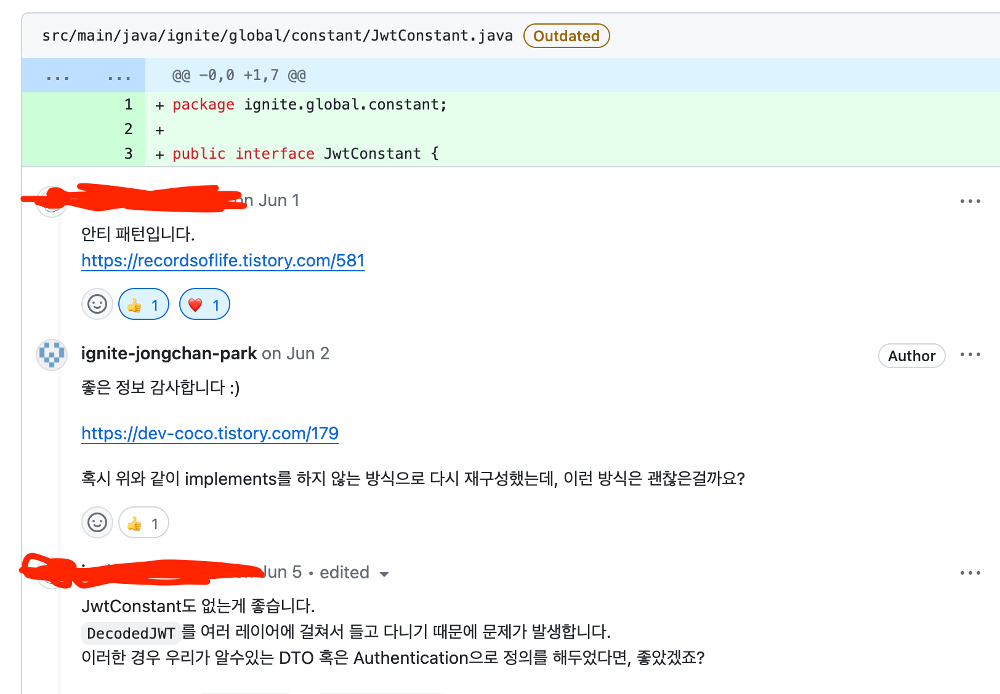

## 1️⃣. 인터페이스의 올바른 사용방법과 안티패턴

인터페이스는 자신을 구현한 클래스의 인스턴스를 참조할 수 있는 `타입` 역할을 한다. 그리고 **인터페이스는 오직 이 용도로만 사용해야 한다.**

이 지침에 맞지 않는 예로 소위 `상수 인터페이스` 라는 것이 있다. **상수 인터페이스란 메소드 없이 상수를 뜻하는 static final 필드로만 가득 찬 인터페이스**를 말한다.

예시)

```java
public interface JwtConstant {
		String MEMBER_ID = "member_id";
    String EMAIL = "email";
    String AUTHORIZED_KEY = "auth";
}
```



- 실제로 회사에서 온보딩 하면서 받은 리뷰입니다… (부끄)

실제 자바 플랫폼 라이브러리에도 이러한 상수 인터페이스가 있습니다.

```java
public interface ObjectStreamConstants {
...
		static final short STREAM_MAGIC = (short)0xaced;

    static final short STREAM_VERSION = 5;

    static final byte TC_BASE = 0x70;

    static final byte TC_NULL =         (byte)0x70;

    static final byte TC_REFERENCE =    (byte)0x71;

    static final byte TC_CLASSDESC =    (byte)0x72;
		...
}
```

위 코드들은 상수 인터페이스로 `static final` 필드로만 이루어진 인터페이스입니다. 위와 같은 상수 인터페이스는 **안티패턴** 이며 인터페이스에 잘못된 사용방법입니다.

## 2️⃣. 상수 인터페이스는 왜 쓰지 말아야 할까?

1. 인터페이스의 목적이 어긋난다.

우리는 인터페이스를 사용하여 구현 클래스가 제공할 동작에 대한 계약을 생성해야 합니다. 상수로 가득 찬 인터페이스를 만들 때 어떤 동작도 정의하지 인터페이스는 목적에 어긋나는 것입니다.

1. 상수 인터페이스를 사용하면 필드 섀도잉으로 인한 런타임 문제가 발생할 수 있습니다.

```java
public interface CalculatorConstants {
    double PI = 3.14159265359;
    double UPPER_LIMIT = 0x1.fffffffffffffP+1023;
    enum Operation {ADD, SUBTRACT, MULTIPLY, DIVIDE};
}
```

```java
public class GeometryCalculator implements CalculatorConstants {    
    public double operateOnTwoNumbers(double numberOne, double numberTwo, Operation operation) {
       // Code to do an operation
    }
}
```

`GeometryCalculator`클래스에서 해당 상수를 정의하면 해당 클래스의 `CalculatorConstants`인터페이스에서 값을 숨기게 됩니다. 그러면 예상치 못한 결과를 얻을 수 있습니다.

즉, 쓰지 않는 필드들이 다른 클래스에서도 사용하지 않는데 `implements`된다는 것입니다.

1. 바이너리 호환성을 위해 추후에 해당 상수들이 사용되지 않더라도 인터페이스를 구현해야한다.

[What is binary compatibility in Java?](https://stackoverflow.com/questions/14973380/what-is-binary-compatibility-in-java)

## 3️⃣. 그러면 어떻게 써야 적절할까요?

### A) 클래스나 인터페이스 자체에 추가를 한다.

```java
public final class Integer extends Number
        implements Comparable<Integer>, Constable, ConstantDesc {
    
    @Native public static final int MIN_VALUE = 0x80000000;
    @Native public static final int MAX_VALUE = 0x7fffffff;
    ...
```

### B) 상수 유틸리티 클래스 제공

인스턴스화 할 수 없는 유틸리티 클래스에 담아 공개한다. Item4번에 있는 내용이므로 복습해보는 것이 좋을 것 같습니다.

```java
public class Test {
		private Test() {
		}

		public static final int A = 3;
    public static final int B = 4;
    public static final int C = 5;
}
```

### C) Enum 활용

열거 타입으로 나타내기 적합한 상수라면 열거 타입으로 만들어 공개

```java
public enum UserType {

    ADMIN("관리자"),
    MEMBER("회원"),
    NON_MEMBER("비회원");

    private final String name;

    UserType(final String name) {
        this.name = name;
    }
}
```

## 4️⃣. 결론

> 즉, 인터페이스는 타입을 정의하는 용도로만 사용해야하며, 상수 공개용 수단으로 사용하면 안된다.
>