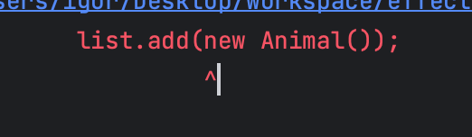

# 아이템 26 로 타입은 사용하지 말라

## 로 타입이 무엇인가? (RAW TYPE)

raw type은 제네릭 타입에서 타입 매게변수를 전혀 사용하지 않을 때를 말합니다.

```java
public interface List<E> extends Collection<E> {
    //......
}
```

List의 raw type은 List입니다. raw type은 타입 선언에서 제네릭 타입 정보가 전부 지워진 것처럼 동작하는데, 제네릭이 도래하기 전 코드와 호환되도록 하기 위한 궁여지책이라 할 수 있다고 합니다.

## 제네릭을 지원하기 전에는 다음과 같이 선언을 함.

```java
public class RawType1 {

    public static void main(String[] args) {

        List list = new ArrayList();
        list.add(new Person());
        list.add(new Animal());

        for (Object o : list) {
            Person p = (Person) o;
            System.out.println(p.toString());
        }
        // java.lang.ClassCastException 발생
    }
}

class Person {
}

class Animal {
}

```

이펙티브 자바에서는 오류는 가능한 발생 즉시, 이상적으로는 컴파일할 때 발견하는 것이 좋다고 하지만, 제네릭이 없을 때는 위와 같이 런타임에 문제를 겪는 코드를 작성하게 되고,

문제가 생겼을 때 전반적으로 코드를 훑어봐야 하는 문제가 생깁니다.

## 제네릭 이후




제네릭 이후에는 엉뚱한 타입의 인스턴스를 넣으려 하면 컴파일 오류가 발생하게 되고, IDE에서도 알아서 검증을 해주게 됩니다.

컴파일러는 컬렉션에서 원소를 꺼내는 모든 곳에 보이지 않는 형변환을 추가하여 절대 실패하지 않음을 보장합니다.

**raw type을 쓰면 제네릭이 안겨주는 안정성과 표현력을 모두 잃게 된다.** 라는게 책의 강력한 주장입니다.

## 그럼 쓰면 안 되는 raw type을 애초에 왜 만들어놓은 걸까?

여러 item에서 궁금했던 내용을 item 26에서 호환성 때문이라고 짚어주었습니다.

자바가 제네릭을 받아들이기까지 거의 10년이 걸린 탓에 제네릭 없이 짠 코드가 이미 세상을 뒤덮어 버렸고,
기존 코드를 모두 수용하면서 제네릭을 사용하는 새로운 코드와도 맞물려 돌아가게 해야만 했다. 가 책의 주장입니다.

## 하지만 또 가능한 예시

List 와 같은 raw type은 사용해서는 안 되나, List<Object> 처럼 임의 객체를 허용하는 매개변수화 타입은 괜찮습니다.

List는 제네릭 타입에서 완전히 발을 뺀 것이고, List<Object>는 모든 타입을 허용한다는 의사를 컴파일러에게 명확히 전달하였기 때문입니다.

## 와일드카드 타입

제네릭 타입을 쓰고 싶지만 실제 타입 매개변수가 무엇인지 신경 쓰고 싶지 않아다면 물음표(?)를 사용하면 됩니다.

어떤 타입이라도 담을 수 있는 가장 범용적인 매게변수화 타입입니다.

```java
static int numElementsInCommon(Set<?> s1, Set<?> s2) {
    //...
}
    
```
비한정적 와일드카드 타입은 Set<?>와 raw type set의 차이는 와일드카드 타입은 안전하고, raw type은 안전하지 않다고 합니다.
raw type 컬렉션에는 아무 원소나 넣을 수 있으니 타입 불변식을 훼손하기 쉽고, Collection<?> 에는 null 외에는 어떤 원소도 넣을 수 없기 때문입니다.

이렇게 하면 컬렉션의 타입 불변식을 훼손하지 못하게 막았음으로 컴파일러는 제 역할을 한 것. 이라고 책에서는 주장합니다. << 장난?

이러한 제약을 받아들일 수 없다면 아이템30, 아이템31을 사용하면 된다고 합니다.

## 소소한 예외

raw type을 사용하지 말라는 규칙에도 소소한 예외가 있습니다.

class 리터럴에는 raw type을 써야 합니다.
단, 배열과 기본 타입은 허용합니다.

List.class, String[].class, int.class 는 허용되고, List<String>.class와 List<?>.class는 허용되지 않습니다.

두번째 예외는 instanceof 연산입니다.

런타임에는 제네릭 타입 정보가 지워지므로  instanceof 연산자는 비한정적 와일드카드 타입 이외의 매개변수화 타입에는 적용할 수 없습니다.
그리고 raw type이든 비한정적 와일드카드 타입이든 똑같이 동작하기 때문에 비한정적 와일드카드 타입의 꺽쇠괄호와 물음표는 아무런 역할 없이 코드만 지저분하게 만드므로, raw type을 사용하는게 깔끔하다고 합니다.

