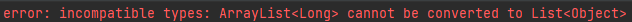
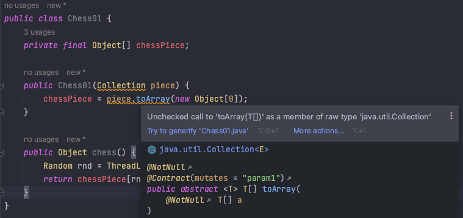
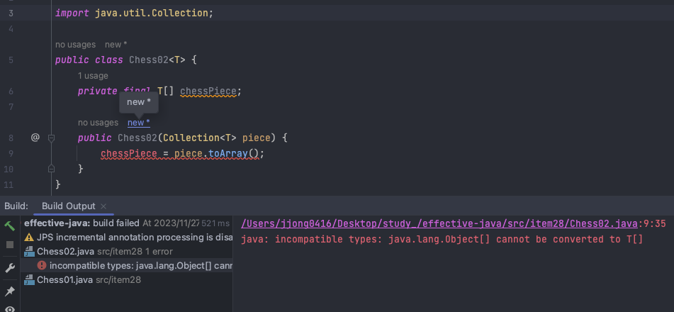

## 1️⃣. 배열과 제네릭 타입의 두 가지 차이점

### A) 공변과 불공변

> 배열은 `공변(convariant)`이고 제네릭은 `불공변`이다.
공변이라는 단어가 어렵게 느껴질 수 있는데, 쉽게 말해서 **함께 변한다는 뜻**이다.
>
- 배열
    - 배열은 공변이다.
    - Sub가 Super의 하위 타입이라면 배열 Sub[]은 배열 Super[]의 하위 타입이 된다.

    ```java
    Object[]objectArray=new Long[1];
    objectArray[0]="타입이 달리 넣을 수 없다."; // ArrayStoreException을 던진다.
    // 런타임에 실패한다.
    ```

    - 배열은 런타임에도 자신이 담기로 한 원소의 타입을 인지하고 확인한다. 그렇기에 컴파일에는 아무런 영향을 끼치지 않지만 런타임시에는 Exception을 던진다.
- 제네릭
    - 제네릭은 불공변이다.
    - 서로 다른 타입 Type1과 Type2가 있을 때, List는 List의 하위 타입도 아니고, 상위 타입도 아니다.

    ```java
    List<Object> ol=new ArrayList<Long>(); // 호환되지 않는 타입이다.
    ol.add("타입이 달라 넣을 수 없다."); 
    // 컴파일 타임에 실패한다.
    ```

  


### B) 실체화(reify)

- 배열은 런타임 시에도 타입의 정보를 가진다.
- 제네릭은 런타임에는 소거(erasure)된다.
    - 즉, 원소 타입을 컴파일타임에만 검사하며, 런타임에는 알 수 없다는 것이다.
    - 자바 5부터 제네릭으로 순조롭게 전환될 수 있도록 해줬다.

## 2️⃣. 배열과 제네릭의 부조화

배열은 `제네릭 타입`, `매개변수화 타입`, `타입 매개변수`로 사용할 수 없습니다. 즉, 코드를 new List[], new E[] 식으로 작성하면 컴파일 할 때, **제네릭 배열 생성 오류**를 일으킨다는 것입니다.

왜 제네릭 배열을 만들지 못하게 할까요?

1. 타입이 안전하지 않기 때문에
2. 이를 허용하게 되는 경우 컴파일러가 자동 생성한 형변환 코드에서 런타임에 ClassCastException이 발생 가능성 존재
3. 런타임에 ClassCastException이 발생하는 일을 막아주겠다는 제네릭 타입 시스템의 취지에 어긋

### 예시

```java
public class Chess01 {
    private final Object[] chessPiece;

    public Chess01(Collection piece) {
        chessPiece = piece.toArray(new Object[0]);
    }

    public Object chess() {
        Random rnd = ThreadLocalRandom.current();
        return chessPiece[rnd.nextInt(chessPiece.length)];
    }
}
```

해당 클래스를 사용하려면 `chess 메소드`를 호출할 때 마다 **Object를 원하는 타입으로 형변환**을 해야한다. 만약, 다른 타입의 원소가 들어있었다면, 런타임에 형변환 오류가 날 것이다.



그렇다면 제네릭으로 만들어보는건 어떨까?

```java
public class Chess02<T> {
    private final T[] chessPiece;

    public Chess02(Collection<T> piece) {
        chessPiece = piece.toArray();
    }
}
```

위 코드를 컴파일 하면 아래와 같은 오류 메세지가 출력된다.



Object 배열을 T 배열로 변환해도 또 다른 경고가 뜬다. T가 무슨 타입인지 알 수 없으니 컴파일러는 이 형변환이 런타임에도 안전을 보장할 수 없다는 것이다. 제네릭에서는 원소의 타입 정보가 소거되어 런타임에는 무슨 타입인지 알 수 없다

올바르게 쓰려고 노력한 코드이다 :D

```java
public class Chess03<T> {
    private final List<T> chessPiece;

    public Chess03(Collection<T> choices) {
        chessPiece = new ArrayList<>(choices);
    }

    public T chess() {
        Random rnd = ThreadLocalRandom.current();
        return chessPiece.get(rnd.nextInt(chessPiece.size()));
    }
}
```