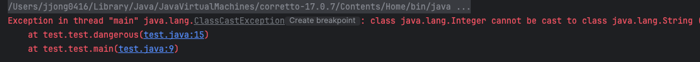
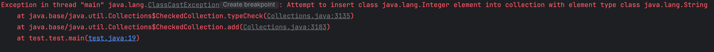

# 서론

가변인수(varargs) 메소드와 제네릭은 Java 5버전부터 추가되었습니다. `가변인수(varargs) 메서드`란, **메서드에 넘기는 인수의 개수를 클라이언트가 조절할 수 있게 하는 것**이다.

SE 버전에 추가되면서 문제없이 잘 쓸 줄 알았지만, 몇가지 문제가 있었습니다.

- **가변인수 메소드를 호출하면, 가변인수를 담기 위해 배열을 자동으로 하나 만들**어주는데, 그 결과 varargs 매개변수에 제네릭이나 매개변수화 타입이 포함되면 컴파일러가 알기 어렵다는 경고를 줍니다.

예시를 하나 봅시다.

```java
public static void main(String[] args) {
    dangerous(List.of("3","4"));
}

public static void dangerous(List<String>... stringLists){
    List<Integer> integers = List.of(42);
		//varargs는 내부적으로 배열이고
	  //배열은 공변이기 때문에 List<String>타입은 Object의 하위클래스로 인식되어
	  //Object[]에 참조 될 수 있다.
    Object[] objects = stringLists;
    objects[0] = integers; // 힙 오염
    String s = stringLists[0].get(0); // ClassCastException
}
```

코드를 하나씩 풀어서 보겠습니다.

1. `List<String>` 형태의 파라미터를 받는 메서드이다.
2. List 제네릭타입 객체를 생성하여 `42라는 값을 추가`하였다.
3. `varargs는 내부적으로 배열이고, 배열은 공변이기 때문에 List[] -> Object[]에 참조`될 수 있다.
4. `Object[0] = integers` 초기화(내부적으로는 List 타입이지만, 런타임에는 제네릭 타입이 소거되므로 같은 List로만 인식되어 할당이 가능하다. **힙 오염 발생**)
5. stringList[0]을 하면 List가 나오고 List의 0번째 인덱스 위치의 객체를 호출해 눈에 보이지 않는 String으로 형변환한다.
    - > 여기서 ClassCastException이 발생

**이처럼 타입안정성이 깨지기 때문에 제네릭 varargs 배열 매개변수에 값을 저장하는 것은 안전하지 않다.**

(실제로 실무에서는 저런 경우는 거의 없다. 웬만하면 varargs 형태로 받아와서 그대로 사용하기 때문)



# `@SafeVarargs`

자바 7 이전에는 가변인수 메소드의 작성자가 호출자 쪽에서 발생하는 경고에 대해서해줄 수 있는 일이 없었다.

사용자는 이 경고를 무시하거나, 사용하는 메소드에서 `@SupprssWarning(“unchecked”)` 달고 경고를 숨겨야만 했다.

자바 7 부터는 `@SafeVarargs`이 추가되어 제네릭 가변인수 메서드 작성자가 클라이언트 측에서 발생하는 경고를 숨길 수 있게 되었다.

단, `@SafeVarargs`은 메소드 작성자가 그 메소드 타입이 안젆마을 보장하는 장치이므로, 안전한 경우에만 사용하는 것이 좋다.

## 안전한 건 어떤 것이고, 위험한 건 어떤 것일까

### 안전

- 메소드 내에서 이 배열을 아무것도 저장하지 않고, 배열의 참조가 밖으로 노출되지 않는다면 타입 안전하다.
- 순수하게 메소드의 생산자 역할만 충실히 하면 메소드는 안전하다.

### 위험

- 자신의 제네릭 매개변수 배열의 참조를 노출하면 위험하다.

```java
static <T> T[] toArray(T... args) {
  return args;
}

static <T> T[] pickTwo(T a, T b, T c) {
  switch(ThreadLocalRandom.current().nextInt(3)) {
    case 0: return toArray(a, b);
    case 1: return toArray(b, c);
    case 2: return toArray(c, a);
  }
  throw new AssertiionError();
}

public static void main(String[] args) {
  String[] attributes = pickTwo("좋은", "빠른", "저렴한");
}
```

## 제네릭 varargs 매개변수를 안전하게 사용하는 메소드

```java
@SafeVarargs
static <T> List<T> flatten(List<? extends T>... lists) {
  List<T> result = new ArrayList<>();
  for(List<? extends T> list : lists) {
    result.addAll(list);
  }
  return result;
}
```

해당 메소드는 안전하다. `varargs` 배열을 직접 노출시키지 않고, T타입의 제네릭 타입을 사용하였기 때문에 `ClassCastException` 또한 발생할 일이 없다.

안전한 varargs 메소드에는 @SafeVarargs를 달아서 컴파일러 경고를 제거하자.

## 제네릭 varargs 매개변수를 List로 대체하라.

```java
static <T> List<T> flatten(List<List<? extends T>> lists) {
  List<T> result = new ArrayList<>();
  for (List<? extends T> list : lists) {
    result.addAll(list);
  }
  return result;
}
```

이 방식의 장점은 이 메서드의 타입 안전성을 검증할 수 있다는 점이다.

@SafeVarargs를 달지 않아도 되며 실수로 안전하다고 판단할 걱정도 없다.

단점은 클라이언트 코드가 살짝 지저분해지고, 속도가 약간 느려질 수 있다는 점이다.

# 정리

- `varargs` 매개변수는 단순히 파라미터를 받아와 **메서드의 생산자(T 타입의 객체를 제공하는 용도)로만 사용하자**.
- varargs는 **read-only**라고 생각하고, **아무런 데이터를 저장하지 말자**
- varargs 배열을 외부에 **리턴하거나 노출하지 말자**. **웬만하면 다시 컬렉션(List)에 담아 리턴하는 안전한 방식을 취하자.**

# + Heap 오염

## 0️⃣. 힙 오염과 그 과정

### 힙 오염

먼저 `힙 오염(Heap pollution)`은 단어 그대로 **JVM의 힙 메모리 영역에 저장되어 있는 특정 변수(객체)가 불량 데이터를 참조함으로써, 힙에서 데이터를 가져오려고 할 때 얘기치 못한 런타임 에러를 발생할 수 있는 상태**를 말합니다.

대표적인 원인 주자로 꼽히는 것이 제네릭(Generics)입니다. Java 5이전에는 `raw type`으로 사용하다 제네릭이 나오면서 `type check` 기능이 추가되어 호환성 문제가 생겼기 때문입니다.

### 제네릭 힙 오염 과정

자바 제네릭 코드를 사용하면서 힙이 오염되는 상황은 다음 두 가지가 있습니다.

1. 원시 타입과 매개변수 타입을 동시에 사용하는 경우
2. 확인되지 않은 형변환을 수행하는 경우

예시를 보자.

```java
public static void main(String[] args) {
    ArrayList<String> list1 = new ArrayList<>();
    list1.add("박종찬");
    list1.add("백엔드");

    // 로직 수행...
    Object obj = list1;
    // 로직 수행...

    ArrayList<Integer> list2 = (ArrayList<Integer>) obj; **// 힙오염!!**

    list2.add(1);
    list2.add(2);

    System.out.println(list2); // [박종찬, 백엔드, 1, 2]

    for(double n : list2) {
        System.out.println(n);
    }
}
```


- 사람이라면 ArrayList<String> →  ArrayList<Double> 으로 바뀌는 것이 잘못된 것을 알아챌수 있겠지만, **컴파일러는 위의 코드에 대해 어떠한 컴파일 에러를 알려주지 않는다**.
- 맨 처음 자바 컴파일러가 문제라고 생각할 수 있지만, 현상의 원인은 **제네릭의 타입 소거에 의해 나타나는 타당한 이유**이기 때문이다.

## 1️⃣. 컴파일러는 타입 캐스팅을 검사하지 않는다.

- 초보 개발자들이 많이들 착각 하는 부분이 **타입 캐스팅에 대해 컴파일러가 꼼꼼하게 체크하는 줄 알고 있다.**
- 컴파일러는 **형변환 대상 객체에 대해 검사하지 않는다. 정확히 말하면 캐스팅 하였을때 대입되는 변수에 저장할 수 있느냐만 검사할 뿐**이다.
- 사람이 보기에는 `ArrayList<String> → Object → ArrayList<Integer>` 이라는 이상한 업 다운 캐스팅이 되었지만, 컴파일러는 list2 변수에 캐스팅한 obj 객체가 대입될수 있는지만 보기 때문에 이러한 논리적인 오류를 잡지 못하는 것이다.

```java
ArrayList<Integer> list2 = (ArrayList<Integer>) obj;
```

## 2️⃣. 제네릭 타입 소거되면 결국 Object타입이 된다.

컴파일 되면서 타입이 소거 되면 결국 제네릭의 타입 파리미터들은 Object로 변환되거나 제거되게 된다. 따라서 위 코드를 컴파일 하게 되면 그대로 `**raw type**`이 되어 버려 어느 타입의 데이터든 저장할 수 있는 상태가 되는 것이다.

따라서, 리스트에 문자열과 소수값 모두 공존하게 된다.

## 3️⃣. 힙 오염 방지책

결국 개발자가 한땀 한땀 따져가며 제네릭을 설계하고 사용할 수 밖에 없는 것인가? 컴파일러의 도움은 못받는 것일까? 😥

이에 대해 자바에서는 Collections 클래스의 checkList() 메소드를 지원한다. 이 메소드는 해당 객체에 대해 의도치 않은 타입의 데이터가 들어갔을 때 이를 감지하고 예외를 발생시켜준다.

아래 예시를 보자.

```java
List<String> list1 = Collections.checkedList(new ArrayList<>(), String.class);
list1.add("박종찬");
list1.add("백엔드");

// 로직 수행...
Object obj = list1;
// 로직 수행...

List<Integer> list2 = (List<Integer>) obj;

list2.add(1);
list2.add(2);

System.out.println(list2); // [박종찬, 백엔드, 1, 2]

for(int n : list2) {
		System.out.println(n);
}
```

- 원래는 for-each 문에서 문제가 있다는 걸 발견하지만, 지금은 `list2.add(1)`와 같이 다른 타입이 들어온 확인한 즉시 Exception을 발생시키는 걸 확인할 수 있다.



> 결국엔 컴파일 타임에 잡아줄 수 없는거구나… 😩😩😩 (그래서 방지책이잖아..!)
>