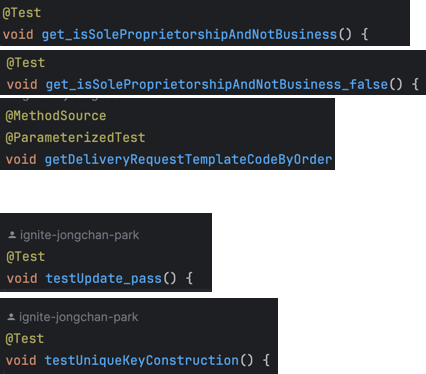
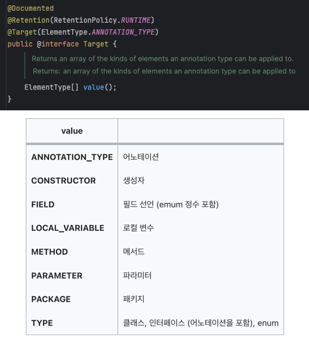
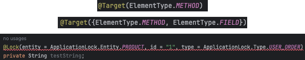
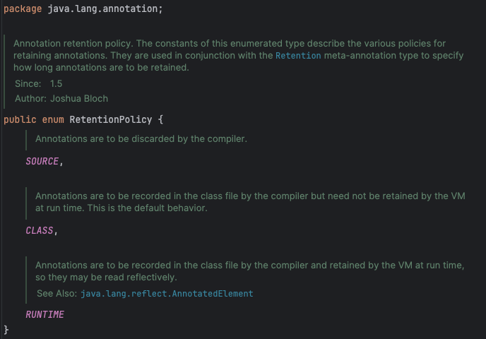
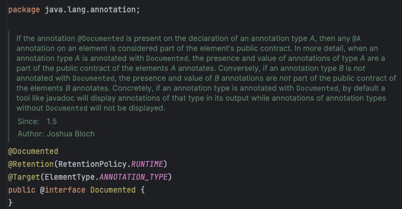

# 1️⃣. 명명 패턴이란?

명명 패턴이란, **변수나 함수의 이름을 일관된 방식으로 작성하는 패턴**을 말한다. 이러한 명명 패턴은 전통적으로 도구나 프레임워크에서 특별히 다뤄야 할 프로그램 요소에 구분을 위해 사용되어 왔다.



# 2️⃣. 명명 패턴의 단점

### 오타가 나면 안된다.

만약 테스트로 시작되어야 할 메소드 이름이 오타로 인해 `tset`로 작성되었다면, 명명 패턴에는 벗어나지만 프로그램 상에서는 문제가 없기 때문에 테스트 메소드로 인식하지 못하고 수행하지 않을 수 있다.

> 그래서 우린 `@Test` 라는 애노테이션을 쓰는데…? 😓
>

### 명명 패턴을 의도한 곳에서만 사용할 거라는 보장이 없다.

개발자는 JUnit3의 명명 패턴인 `test`를 메서드가 아닌 **클래스의 이름**으로 지음으로써 해당 클래스의 모든 테스트 메서드가 수행되길 바랄 수 있다. 하지만 JUnit은 클래스 이름에는 관심이 없다. 따라서 개발자가 의도한 테스트는 전혀 수행되지 않는다.

### 명명 패턴을 적용한 요소를 매개변수로 전달할 마땅한 방법이 없다.

특정 예외를 던져야 성공하는 테스트가 있을 때, 메서드 이름에 포함된 문자열로 예외를 알려주는 방법이 있지만 보기 흉할 뿐 아니라 컴파일러가 문자열이 예외 이름인지 알 도리가 없다.

> 우린 메소드에서 알 순 없지만, 코드에서 `assertThrows`라는 것을 통해 알 수 있습니다.
>

# 3️⃣. 마커 애너테이션

마커 애너테이션은 **아무 매개변수 없이 단순히 대상에 마킹하는 용도로 사용하는 애너테이션**을 말합니다.

```java
/**
* 테스트 메서드임을 선언하는 애너테이션이다.
* 매개변수 없는 정적 메서드 전용
*/
@Retention(RetentionPolicy.RUNTIME)
@Target(ElementType.METHOD)
public @interface Test{
}
```

```java
@Test
void test...(){
}
```

이러한 **마커 애너테이션은 적절한 애너테이션 처리기가 필요**하다. 그렇다면 `@Test`는 어떻게 처리되는 것일까?

```java
// 마커 애너테이션 처리기
public class MarkerAnnotationTest {
  public static void main(String[] args) throws Exception {
    int tests = 0;
    int passed = 0;
    Class<?> testClass = Class.forName(args[0]);
    for (Method m : testClass.getDeclaredMethods()) {
      if (m.isAnnotationPresent(Test.class)) {
        tests++;
        try {
          m.invoke(null);
          passed++;
        } catch (InvocationTargetException wrappedExc) {
          Throwable exc = wrappedExc.getCause();
          System.out.println(m + " 실패: " + exc);
        } catch (Exception exc) {
          System.out.println("잘못 사용한 @Test: " + m);
        }
      }
    }
    System.out.printf("성공: %d, 실패: %d%n",
                      passed, tests - passed);
  }
}
```

결국에는 @Test 애너테이션은 코드에 직접적인 영향을 주지는 않는다. 그저 **이 애너테이션에 관심 있는 프로그램에게 추가적인 정보를 제공할 뿐**이다.

## 메타 애너테이션

메타 애너테이션이란 `에너테이션에 다는 애너테이션`을 말하게 됩니다.

```java
@Retention(RetentionPolicy.RUNTIME)
@Target(ElementType.METHOD)
@Documented
```

**이런 것들이 있는데, 조금 더 디테일하게 알아보자.**

### @Target

`@Target` 은 해당 애노테이션이 적용될 수 있는 타입(클래스, 메소드, etc)을 지정하는데 사용합니다.





### @Retention

`@Retention`은 어느 시점까지 어노테이션의 메모리를 가져갈 것인지 즉, **`지속시간`**을 결정하는데 사용합니다.



정책은 크게 `SOURCE`, `CLASS`, `RUNTIME`이 있습니다.

- `SOURCE`: 자바 소스 파일에 존재하는 것으로, 컴파일 이후 클래스 파일이 되면 사라진다. 즉, **클래스 파일이 되기 이전까지 지속**된다.
- `CLASS`: 클래스 파일까지는 존재하지만, 실행할 때 사용하지는 않는다. 즉, **런타임이 실행되기 전까지만 존재(기본값)**
- `RUNTIME`: 클래스 파일까지 존재하며, 실행 시 사용한다. **즉, 지속 시간이 가장 길다**.

### @Document



해당 애노테이션은 Javadoc에 포함시킨다는 애노테이션입니다.

# 4️⃣. 매개변수를 가진 애너테이션

```java
// 명시한 예외를 던져야만 성공하는 테스트 메서드용 애너테이션
@Retention(RetentionPolicy.RUNTIME)
@Target(ElementType.METHOD)
public @interface ExceptionTest {
  Class<? extends Throwable> value();
}
```

이 애너테이션의 매개변수 타입은 `Class<? extends Throwable>`이다.

여기서의 와일드카드 타입은 **Throwable을 상속받은 Class 객체 라는 뜻이고, 모든 예외 타입을 다 수용**한다.

이는 아이템 33의 한정적 타입 토큰의 또 하나의 활용 사례다.

```java
public class Sample2 {
   @ExceptionTest(ArithmeticException.class)
   public static void m1() { // 성공해야 한다.
      int i = 0;
      i = i / i;
   }
   
   @ExceptionTest(ArithmeticException.class)
   public static void m2() { // 실패해야 한다. (다른 예외 발생)
      int[] a = new int[0];
      int i = a[1];
   }
   
   @ExceptionTest(ArithmeticException.class)
   public static void m3() { } // 실패해야 한다. (예외가 발생하지 않음)
}
```

# 5️⃣. 반복 가능한 애너테이션

Java8 부터는 단일 요소에 애너테이션을 반복적으로 달 수 있는 @Repeatable 메타 애너테이션을 제공한다. 따라서 배열 매개변수 대신 `@Repeatable` 메타 애너테이션을 달면 단일 요소에 반복적으로 적용할 수 있다.

## @Repeatable 사용 시 주의점

- @Repeatable을 명시한 애너테이션을 반환하는 컨테이너 애너테이션을 하나 더 정의해야 한다.
- @Repeatable에 해당 컨테이너 애너테이션의 class 객체를 매개변수로 전달해야 한다.
- 컨테이너 애너테이션은 내부 애너테이션 타입의 배열을 반환하는 value 메서드를 정의해야 한다.
- 적절한 @Retention과 @Target을 명시해야 한다. 그렇지 않으면 컴파일되지 않는다.

```java
@Retention(RetentionPolicy.RUNTIME)
@Target(ElementType.METHOD)
@Repeatable(ExceptionTestContainer.class)
public @interface ExceptionTest {
  Class<? extends Throwable> value();
}

@Retention(RetentionPolicy.RUNTIME)
@Target(ElementType.METHOD)
public @interface ExceptionTestContainer {
  ExceptionTest[] value();
}
```

### 적용 방법

```java
@ExceptionTest(IndexOutOfBoundsException.class)
@ExceptionTest(NullPointerException.class)
public static void doublyBad() { }
```

# 6️⃣. 정리

### 애너테이션으로 처리할 수 있다면 명명 패턴을 사용할 이유는 없다.

끗.