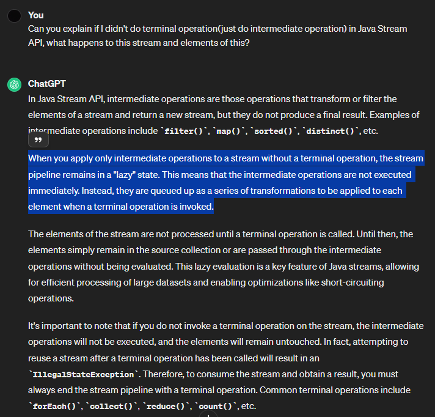

# [Item 45] 스트림은 주의해서 사용하라
## 1. Stream API?
- 추상 개념
  1. **stream** : 데이터 원소의 유/무한 시퀀스
  2. **stream pipeline** : 원소들로 수행하는 연산 단계

### Features of Stream API
1. Inner iteration<sup>[4]</sup>
   - for문, while문 등으로 직접 Collection의 element를 가져오는 것(외부 반복자)이 아닌 내부에서 반복시키는 패턴
   - 개발자는 element당 처리 할 코드만 제공
   - 효율적으로 요소 반복 가능 : 반복 순서 변경 or 병렬 처리
2. 람다식으로 element 처리
3. Method chaining<sup>[5]</sup>

### Advantages of Stream API<sup>[5]</sup>
1. 코드의 간결성
   - 숙련자는 글을 읽듯이 로직을 순차적으로 읽으면 됨
2. 병렬 처리의 용이성
3. 요소의 개수가 정해지지 않아도 Collection 내부의 무한으로 데이터를 다룰 수 있음

### Stream Pipeline
- 흐름<sup>[1]</sup><sup>[2]</sup><sup>[3]</sup>
  1. **소스 스트림** : 배열, 컬렉션, 파일, 다른 스트림 등으로 스트림을 구성
  2. **중간 연산** : 스트림을 같거나 다른 타입으로 변환하거나, 필터링, 정렬 등의 과정으로 한 스트림을 다른 스트림으로 변환
     - filter, map, sorted
  3. **종단 연산** : 마지막 중간 연산이 처리한 스트림에 선택, 출력 등의 최후의 연산
     - collect, forEach, match, count, reduce
  4. **short-circuit 연산** : 개수가 정해지지 않은 무한 스트림에서 유한 스트림으로 개수를 제한함 -> 속도 UP!
     - limit(중간 연산), findFirst, findAny, anyMatch, allMatch, noneMatch
     
- 지연 평가
  - 스트림은 종단 연산이 호출될 때 평가(중간 연산)가 이루어짐
  - 종단 연산에 사용되지 않은 원소는 계산 X
  - 무한 스트림을 다룰 수 있도록 함 : 종단 연산이 없는 스트림 파이프라인은 아무 일도 하지 않는 것

- fluent API : 메서드 연쇄 지원
  - 여러 파이프라인을 연결하여 표현식 하나로 만듬
  - 순차적 수행
  - parallel 메서드를 이용하여 병렬로 호출 가능하나, 효과를 볼 수 있는 상황은 적음

### Without Terminal Operation, Stream & Elements Will Be..?
- 이론 상, Stream은 **종단 연산과 마주했을 경우에 그 때부터 중간 연산을 수행**함 : 지연 평가
  - 안타깝게도 이와 관련된 문서가 모두 effective java 게시글이라 Chat GPT에 물어봄
  
- 실제로 보고 싶어서 여러 방식을 시도했으나 종단 연산이 없으면 데이터 관측 불가능
  - IntelliJ의 스트림 디버깅(하단 Debug console 맨 우측에 Trace Current Stream Chain)을 진행하려 했으나, 종단 연산이 없으면 호출되지 않음
    - 종단 연산이 있는 스트림 디버깅시에 굉장히 유용함<sup>[6]</sup>
  - 일반 디버깅 시에는 Stream 객체 내부의 element에 대한 정보가 뜨지 않아서 직접 눈으로 확인은 불가능

## 2. Usage of Stream
- 스트림은 잘 사용하면 깔끔해지지만, 과용 시에는 이해하거나 유지보수가 힘듬
- 람다 식에서는 타입 이름을 생략하므로 매개변수 이름을 잘 지어서 가독성을 높이기
  - ex) filter(c -> !c.isCartEmpty()) -> filter(customer -> !customer.isCartEmpty())
- 스트림 파이프라인에서는 도우미 메서드를 적절히 활용
- 기존 코드는 스트림을 사용하도록 리팩터링하되, 스트림을 사용한 새 코드가 더 나아보일 때 반영
- 자바는 스트림에 기본 원소인 char용 스트림을 지원하지 않으므로, **char 처리 시에는 스트림 자제**
```java
import lombok.Builder;
import lombok.Getter;

import java.util.List;

@Getter
public class Applicant {
    private long id;
    private String name;
    private String department;
    private List<Career> careers;

    @Builder
    public Applicant(long id, String name, String department, List<Career> careers) {
        this.id = id;
        this.name = name;
        this.department = department;
        this.careers = careers;
    }
}
```
```java
import lombok.Builder;
import lombok.Getter;

@Getter
public class BlindInterviewee {

    private long id;
    private String department;

    @Builder
    public BlindInterviewee(long id, String department) {
        this.id = id;
        this.department = department;
    }
}
```
```java
import java.util.Comparator;
import java.util.List;
import java.util.stream.Collectors;

public class ApplicantServiceImpl {
    public List<BlindInterviewee> pickIntervieweeFromApplicants(List<Applicant> applicantList) {
        return applicantList.stream()
                .filter(applicant -> !applicant.getCareers().isEmpty())
                .map(passed -> BlindInterviewee.builder()
                        .id(passed.getId())
                        .department(passed.getDepartment())
                        .build())
                .sorted(Comparator.comparing(BlindInterviewee::getDepartment))
                .collect(Collectors.toList());
    }
}
```

### 스트림과 맞지 않는 예시
1. 지역 변수를 수정해야 하는 일
    - 람다식에는 외부 변수를 사용 시, final 혹은 Effectively Final 변수만을 사용해야 한다
2. return, break, continue로 메서드 혹은 반복문을 제어할 필요가 있는 경우
3. 메서드 선언에 명시된 검사 예외를 던져야 하는 경우<sup>[Item 71]</sup>
4. 데이터가 스트림 파이프라인의 여러 단계 통과 시, 각 단계의 값들에 동시에 접근해야 하는 경우
   - 스트림은 한번 매핑하고 나면 원래 값들은 잃어버리는 구조
   - 이런 경우에 스트림을 반드시 사용해야 한다면, **매핑을 거꾸로 수행**하는 방법으로 해결

### 스트림과 찰떡인 예시
1. 원소들의 시퀀스를 일관되게 변환 ex) map, flatMap
2. 원소들의 시퀀스 필터링 및 특정 조건 만족하는 원소 찾기 ex) filter
3. 원소들의 시퀀스를 하나의 연산을 사용해 결합(덧셈, 연결, 최솟값 등) ex) sum, max, min
4. 원소들의 시퀀스를 collection에 모으기 ex) collect

## 3. Flattening for flatMap
- 스트림의 원소 각각을 하나의 스트림으로 매핑하고, 그 스트림을 하나의 스트림으로 합침
```java
import java.util.List;

public class ApplicantServiceImpl {
    public double getAverageWorkingDays(List<Applicant> applicantList) {
        return applicantList.stream()
                .flatMapToInt(applicant -> applicant.getCareers().stream()
                        .mapToInt(Career::getWorkingDays))
                .average()
                .getAsDouble();
    }
}
```

## References
[1] https://zangzangs.tistory.com/171
[2] https://colevelup.tistory.com/12
[3] https://www.geeksforgeeks.org/java-8-stream-tutorial/
[4] https://m.blog.naver.com/PostView.naver?isHttpsRedirect=true&blogId=qkrghdud0&logNo=220702640712
[5] https://www.geeksforgeeks.org/stream-in-java/
[6] https://androphil.tistory.com/760