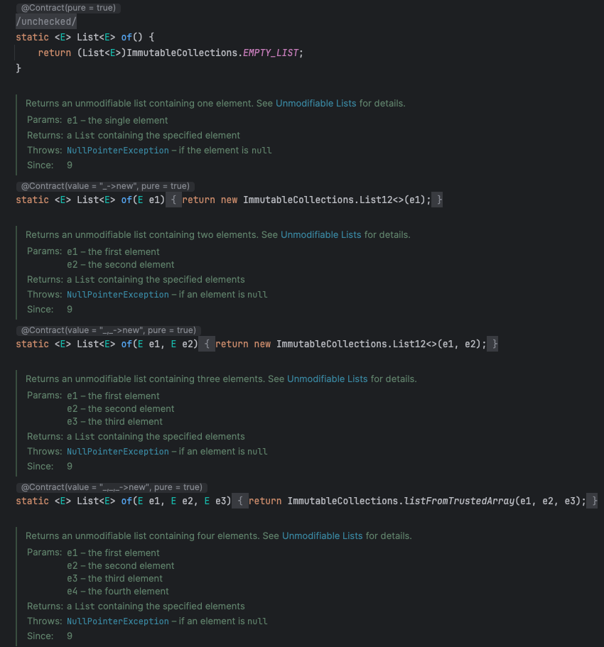
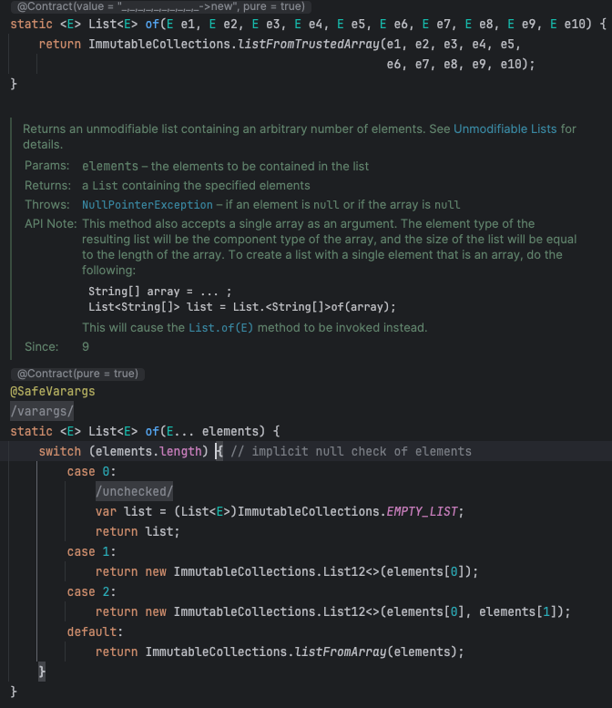
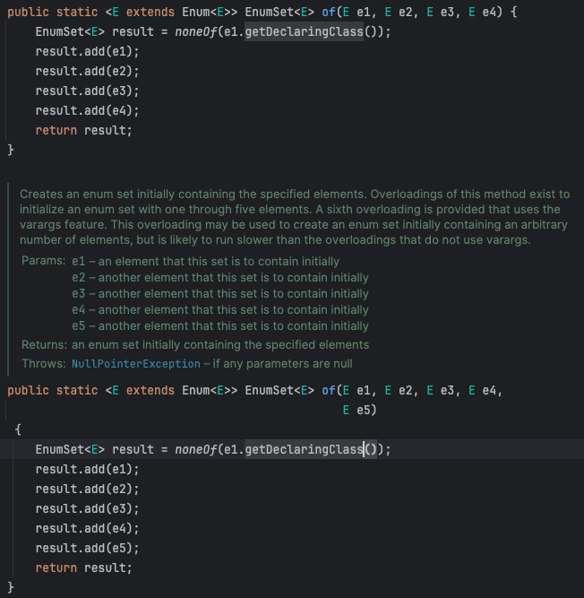

## 1️⃣. 가변인수가 등장하기 전에는?

varargs는 Java 5에 도입되었다. 그렇다면 그 이전에는 “임의 개수의 인자가 전달되어 올 수 있는 상황”에 대해서는 어떻게 다루고 있었을까?

바로 **`배열을 받는 메서드를 명시적으로 배열을 인자로 받는 메서드로 선언하는 것`**이다.

```java
/* 배열로 받는 메소드*/
public int sum(int[] args) {
	...
}

/* N개의 메소드를 선언해 인자를 받는 메소드 */
public int sum() { ... }

public int sum(int value) { ... }

public int sum(int val1, int val2) { ... }
```

## 2️⃣. 가변인수

- 명시한 타입의 인수를 0개 이상 받을 수 있다.
- **가변인수 메소드를 호출 시 반드시 배열을 생성하여 인수들을 배열에 저장하여 해당 메소드에 이 배열을 전달한다.**
    - 가변인수 메소드를 호출하면 가장 먼저 인자의 개수와 길이가 같은 배열로 만들어준다.
- 기존의 `보일러 플레이트`한 코드들(반복되고 지루한 코드들) 을 없애주었다.

```java
static int sum(int... args){
  int sum = 0;
  for (int arg : args){
    sum += arg;
  }
  return sum;
}

// sum(1, 2, 3) => return 6
// sum() => return 0
```

## 3️⃣. 인수가 1개 이상이어야 하는 상황

이런 상황에서 **가변인수만을 통해 상황을 제어하려고 한다면, 아래와 같은 코드가 필요**할 것이다.

```java
static int min(int... args) {
    if (args.length == 0)
        throw new IllegalArgumentException("인수가 1개 이상 필요합니다.");
    int min = args[0];
    for (int i = 1; i < args.length; i++)
        if (args[i] < min)
            min = args[i];
    return min;
}
```

이렇게 하면 몇가지 문제가 있다.

- 코드에서 인수 하나를 무조건 받아오도록 하기 위해 **코드가 더러워**진다.
- `컴파일 타임 에러가 아닌 런타임 에러`에서만 확인할 수 있다.

## 4️⃣. 더 좋은 방식이 있다.

```java
static int min(int firstArgs, int... remainingArgs) {
    int min = firstArg;
    for (int arg : remainingArgs)
        if (arg < min)
            min = arg;
    return min;
}
```

위의 코드처럼 매개변수를 2개 받도록 하면 된다. 즉, 첫 번째로는 평범한 매개변수를 받고, 가변인순느 두번째로 받으면 앞서 생긴 문제를 해결할 수 있다.

## 5️⃣. 성능에 민감한 상황이라면?

- 호출 시 마다 배열을 하나 할당하고 초기화하기 때문에, 성능에 민감한 상황에는 걸림돌이 될 수 있다.

동일한 타입의 변수 여러 개를 전달하는 것이 필요한 경우에는

- 1개를 전달
- 2개를 전달
- 3개를 전달
- 4개 이상을 전달…

로 나눠볼 수 있다. 만약 4개 미만을 전달 하는 경우가, 전체 호출양의 대다수를 차지하고 있다면

```cpp
public int sum() {}
public int sum(int a1, int a2) {}
public int sum(int a1, int a2, int a3) {}
public int sum(int a1, int a2, int a3, int... rest) {}

```

위와 같이 4개 미만의 경우에 대해서는 `가변인수 메소드가 아닌` 메소드들을 다중 정의하고, 4개 이상의 경우에 대해서는 가변인수를 활용하도록 하는 것을 생각해 볼 수 있다.

## 5️⃣. 어디서 사용하고 있을까?

### A) List.of 정적 팩토리 메소드



결론적으로 List.of 는 파라미터 10개까지는 메소드로 구현되어 있고, 그 이상은 가변배열로 처리하는걸 볼 수 있습니다.

### B) EnumSet

EnumSet의 정적 팩토리도 이 기법을 사용해 열거 타입 집합 생성 비용을 최소화 하고 있다.


---

### +) 우리는 어떤 방식을 사용할까?

```java
public static <T> List<T> convert(Class<T> type, MultipartFile multipartFile) {
        ...
}

public static <T> List<T> convert(Class<T> type, MultipartFile multipartFile, int index) {
	      ...
}
```